# ClubSys - Consolidated Database Schema (ErdV3)

This document represents the complete, consolidated Entity Relationship Diagram (ERD) for the ClubSys project, merging all previous versions into a final, comprehensive schema.

---

### 1. High-Level Concept: The 5 Modules

The database is organized into five logical modules that group related tables:

1.  **Identity & Membership:** Manages users, roles, and their relationship with organizations.
    *   `Users`, `OrgMemberships`
2.  **Organization Structure (The Core):** Defines the clubs, their internal committees, and the hierarchical tree structure.
    *   `Organizations`, `Committees`, `TreeNodes`, `ArchivedTrees`
3.  **Governance & History:** Powers the "Round Table" voting and tracks all significant actions.
    *   `Proposals`, `Votes`, `AuditLogs`
4.  **Operations & Communications:** Handles day-to-day activities like events, attendance, documents, and communication.
    *   `Events`, `AttendanceLogs`, `IotDevices`, `OrgDocuments`, `Announcements`, `Notifications`
5.  **Finance:** Manages the autonomous budget system, from high-level requests down to individual line items.
    *   `BudgetRequests`, `BudgetLineItems`

---

### 2. The Complete Visual ERD (Mermaid)

This diagram illustrates the relationships between all 17 tables in the system.

```mermaid
erDiagram
    %% Identity & Membership
    USERS ||--|{ ORG_MEMBERSHIPS : "has"
    ORGANIZATIONS ||--|{ ORG_MEMBERSHIPS : "has"
    USERS {
        GUID UserID PK
        string StudentID UK
        string FullName
        string Email
        string PasswordHash
        enum GlobalRole
    }
    ORG_MEMBERSHIPS {
        int MembershipID PK
        GUID UserID FK
        int OrgID FK
        enum Status
        datetime JoinedDate
    }

    %% Organization Structure
    ORGANIZATIONS ||--|{ COMMITTEES : "has"
    ORGANIZATIONS ||--|{ TREE_NODES : "is_structured_by"
    ORGANIZATIONS ||--|{ ARCHIVED_TREES : "has_history_of"
    COMMITTEES ||--o{ TREE_NODES : "can_be_assigned_to"
    TREE_NODES }|--o| TREE_NODES : "is_child_of"
    USERS ||--o{ TREE_NODES : "can_be_assigned_to"
    ORGANIZATIONS {
        int OrgID PK
        string Name
        string Acronym
        decimal TotalBalance
        bool IsActive
    }
    COMMITTEES {
        int CommitteeID PK
        int OrgID FK
        string Name
        decimal AllocatedBudget
    }
    TREE_NODES {
        int NodeID PK
        int OrgID FK
        int ParentNodeID FK
        int CommitteeID FK
        GUID UserID FK
        string PositionName
        json Coordinates
    }
    ARCHIVED_TREES {
        int ArchiveID PK
        int OrgID FK
        string SchoolYear
        json TreeSnapshotJSON
        datetime ArchivedAt
    }

    %% Governance & History
    ORGANIZATIONS ||--|{ PROPOSALS : "is_governed_by"
    PROPOSALS ||--|{ VOTES : "is_decided_by"
    USERS ||--|{ VOTES : "casts"
    USERS ||--|{ AUDIT_LOGS : "is_actor_in"
    PROPOSALS {
        int ProposalID PK
        int OrgID FK
        GUID CreatedByUserID FK
        enum ProposalType
        enum Status
        json DataPayload
    }
    VOTES {
        int VoteID PK
        int ProposalID FK
        GUID VoterUserID FK
        bool Verdict
        datetime VoteTime
    }
    AUDIT_LOGS {
        int LogID PK
        GUID ActorUserID FK
        enum ActionType
        string TargetTable
        string Details
        datetime Timestamp
    }

    %% Operations & Communications
    ORGANIZATIONS ||--|{ EVENTS : "hosts"
    ORGANIZATIONS ||--|{ ORG_DOCUMENTS : "has"
    ORGANIZATIONS ||--o{ ANNOUNCEMENTS : "posts"
    USERS ||--|{ ANNOUNCEMENTS : "authors"
    USERS ||--|{ NOTIFICATIONS : "receives"
    USERS ||--|{ ORG_DOCUMENTS : "uploads"
    EVENTS ||--|{ ATTENDANCE_LOGS : "tracks"
    USERS ||--|{ ATTENDANCE_LOGS : "scans_for"
    IOT_DEVICES ||--|{ ATTENDANCE_LOGS : "validates"
    ORGANIZATIONS ||--|{ IOT_DEVICES : "owns"
    
    EVENTS {
        int EventID PK
        int OrgID FK
        GUID ProposerUserID FK
        enum ApprovalStatus
        string Title
        datetime Date
    }
    ATTENDANCE_LOGS {
        int LogID PK
        int EventID FK
        GUID UserID FK
        string DeviceID FK
        datetime ScanTime
        enum Status
    }
    IOT_DEVICES {
        string DeviceID PK
        int OrgID FK
        string RoomName
        string ApiSecretKey
        bool IsActive
    }
    ORG_DOCUMENTS {
        int DocumentID PK
        int OrgID FK
        GUID UploaderUserID FK
        string Title
        string FilePath
        enum Visibility
    }
    ANNOUNCEMENTS {
        int AnnouncementID PK
        int OrgID FK
        GUID AuthorID FK
        string Title
        text Body
        enum Priority
        enum Visibility
    }
    NOTIFICATIONS {
        int NotificationID PK
        GUID RecipientUserID FK
        string Title
        string Message
        int RelatedEntityID
        bool IsRead
    }

    %% Finance
    COMMITTEES ||--|{ BUDGET_REQUESTS : "submits"
    EVENTS ||--o{ BUDGET_REQUESTS : "can_be_for"
    BUDGET_REQUESTS ||--|{ BUDGET_LINE_ITEMS : "details"
    BUDGET_REQUESTS {
        int RequestID PK
        int CommitteeID FK
        int EventID FK
        decimal AmountRequested
        enum Status
    }
    BUDGET_LINE_ITEMS {
        int LineItemID PK
        int RequestID FK
        string ItemName
        decimal EstimatedCost
        string ReceiptURL
    }
```

---

### 3. Detailed Table Schema (17 Tables)

#### Module A: Identity & Membership
**1. `Users`**
  * `UserID` (PK, GUID)
  * `StudentID` (String, Unique)
  * `FullName` (String)
  * `Email` (String, Unique)
  * `PasswordHash` (String)
  * `GlobalRole` (Enum: Admin, Student)

**2. `OrgMemberships`** (The Roster)
  * `MembershipID` (PK)
  * `UserID` (FK to `Users`)
  * `OrgID` (FK to `Organizations`)
  * `Status` (Enum: Pending_Vetting, Active, Rejected, Archived)
  * `JoinedDate` (DateTime)

#### Module B: Organization Structure
**3. `Organizations`**
  * `OrgID` (PK)
  * `Name` (String)
  * `Acronym` (String)
  * `OrgType` (Enum: Academic, Non-Academic)
  * `TotalBalance` (Decimal) - *The main "Org Wallet".*
  * `IsActive` (Boolean)

**4. `Committees`**
  * `CommitteeID` (PK)
  * `OrgID` (FK to `Organizations`)
  * `Name` (String, e.g., "Logistics")
  * `AllocatedBudget` (Decimal) - *The "Scoped" wallet committee leads can see.*

**5. `TreeNodes`** (Crucial for Vue Flow)
  * `NodeID` (PK)
  * `OrgID` (FK to `Organizations`)
  * `ParentNodeID` (FK, Self-referencing, Nullable) - *Links to the node above it.*
  * `CommitteeID` (FK to `Committees`, Nullable)
  * `AssignedUserID` (FK to `Users`, Nullable) - *Who holds this position?*
  * `PositionName` (String) - *e.g., "VP Internal", "Logistics Member"*
  * `Coordinates` (JSON) - *Stores X/Y position for Vue Flow to remember node placement.*

**6. `ArchivedTrees`**
  * `ArchiveID` (PK)
  * `OrgID` (FK to `Organizations`)
  * `SchoolYear` (String, e.g., "2024-2025")
  * `TreeSnapshotJSON` (Text/JSON) - *Saves the entire tree structure for the "History" tab.*
  * `ArchivedAt` (DateTime)

#### Module C: Governance & History
**7. `Proposals`**
  * `ProposalID` (PK)
  * `OrgID` (FK to `Organizations`)
  * `CreatedByUserID` (FK to `Users`)
  * `ProposalType` (Enum: StructureChange, BudgetRelease, EventApproval)
  * `Status` (Enum: Pending, Approved, Rejected)
  * `DataPayload` (JSON) - *Stores "Before" and "After" data for the proposal.*
  * `CreatedAt` (DateTime)

**8. `Votes`**
  * `VoteID` (PK)
  * `ProposalID` (FK to `Proposals`)
  * `VoterUserID` (FK to `Users`) - *Must be one of the Top 3 Heads.*
  * `Verdict` (Boolean: True=Approve, False=Reject)
  * `VoteTime` (DateTime)

**9. `AuditLogs`** (The Black Box)
  * `LogID` (PK)
  * `ActorUserID` (FK to `Users`) - *Who performed the action?*
  * `ActionType` (Enum: Login, Create_Proposal, Vote, Delete_Node, etc.)
  * `TargetTable` (String) - *Which table was affected?*
  * `Details` (String) - *e.g., "Changed Org Name from 'CS' to 'CS Society'"*
  * `Timestamp` (DateTime)

#### Module D: Operations & Communications
**10. `Events`**
  * `EventID` (PK)
  * `OrgID` (FK to `Organizations`)
  * `ProposerUserID` (FK to `Users`)
  * `ApprovalStatus` (Enum: Pending_Internal, Pending_Admin, Active)
  * `Title` (String)
  * `Date` (DateTime)
  * `Venue` (String)

**11. `IotDevices`** (Refined for Security)
  * `DeviceID` (PK, String) - *The Chip ID of the ESP8266.*
  * `OrgID` (FK to `Organizations`)
  * `RoomName` (String) - *Where the device is located.*
  * `ApiSecretKey` (String, Hashed) - *Secret key for the hardware to authenticate itself.*
  * `IsActive` (Boolean)

**12. `AttendanceLogs`** (Updated for IoT Fallback)
* `LogID` (PK)
* `EventID` (FK to `Events`)
* `UserID` (FK to `Users`) - *The student attending.*
* `DeviceID` (FK to `IotDevices`, **Nullable**) - *NULL if entered manually.*
* `ScanTime` (DateTime)
* `Status` (Enum: Success, Failed)
* **`EntryMethod`** (Enum: `IoT_Scan`, `Manual_Override`) - *Distinguishes hardware scans from human encoding.*
* **`EncodedByUserID`** (FK to `Users`, **Nullable**) - *The Committee Lead who manually encoded the student (if Method = Manual).*

**13. `OrgDocuments`** (The Document Vault)
  * `DocumentID` (PK)
  * `OrgID` (FK to `Organizations`)
  * `UploaderUserID` (FK to `Users`)
  * `Title` (String)
  * `FilePath` (String) - *URL to the file in storage.*
  * `Visibility` (Enum: Public, OfficersOnly, AdminOnly)

**14. `Notifications`** (The Red Bell Icon)
  * `NotificationID` (PK)
  * `RecipientUserID` (FK to `Users`)
  * `Title` (String)
  * `Message` (String)
  * `RelatedEntityID` (Nullable INT) – *Links to a specific ProposalID, EventID, etc.*
  * `IsRead` (Boolean)
  * `CreatedAt` (DateTime)

**15. `Announcements`** (The News Feed)
  * `AnnouncementID` (PK)
  * `OrgID` (FK, Nullable) - *NULL for school-wide, NOT NULL for org-specific.*
  * `AuthorID` (FK to `Users`)
  * `Title` (String)
  * `Body` (Text/HTML)
  * `Priority` (Enum: Normal, High_Pinned)
  * `Visibility` (Enum: Public, MembersOnly)
  * `PostedAt` (DateTime)

#### Module E: Finance
**16. `BudgetRequests`**
  * `RequestID` (PK)
  * `CommitteeID` (FK to `Committees`)
  * `EventID` (FK to `Events`, Nullable)
  * `AmountRequested` (Decimal)
  * `Status` (Enum: Pending_Audit, Pending_Vote, Approved, Liquidated)

**17. `BudgetLineItems`**
  * `LineItemID` (PK)
  * `RequestID` (FK to `BudgetRequests`)
  * `ItemName` (String, e.g., "50pcs Balloons")
  * `EstimatedCost` (Decimal)
  * `ReceiptURL` (String, Nullable) - *URL for this specific item's receipt.*

---

### 4. `Announcements` vs. `Notifications` Clarification

It is critical to distinguish between these two tables in the application logic.

| Feature | **Announcements** | **Notifications** |
| :--- | :--- | :--- |
| **Analogy** | **A Public Wall Post** | **A Private Message or Alert** |
| **Purpose** | Information for **a group** (or everyone). | Action items or alerts for **one specific person**. |
| **Direction** | One-to-Many | One-to-One |
| **Persistence** | Stays visible until archived or deleted. | Can be dismissed after being read/acted upon. |
| **Table** | `Announcements` | `Notifications` |

---

### 5. Design Rationale

*   **For Vue Flow:** The `TreeNodes` self-referencing `ParentNodeID` allows for efficient, recursive fetching of the entire organizational hierarchy, making it easy to render the visual tree.
*   **For Round Table Voting:** The generic `Proposals` table can handle voting on any issue (structure, budget, events) without needing separate tables for each, making the governance engine flexible and scalable.
*   **For Data Integrity:** Separating `Users` and `OrgMemberships` allows for clear distinction between a person's system account and their status within any given organization, simplifying queries and role management.