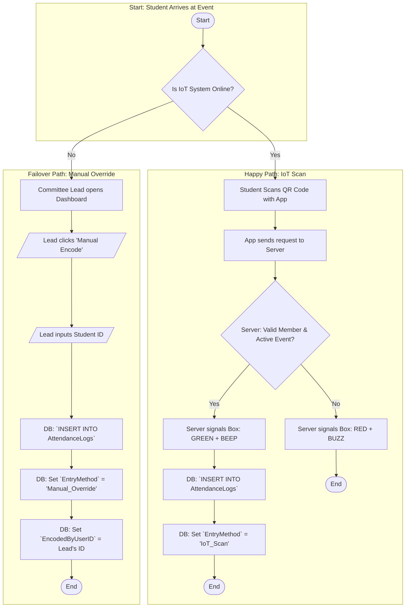
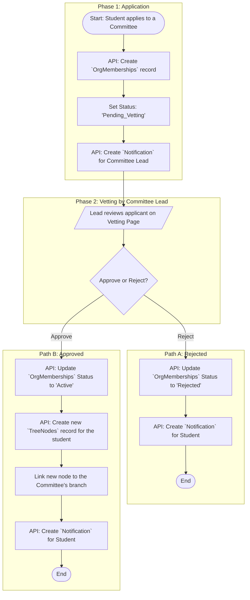
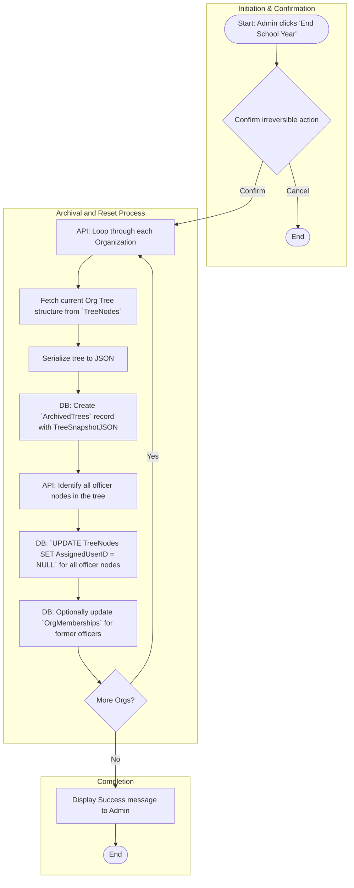

# ClubSys: System Logic Flowcharts

This document outlines the critical logic flows for the ClubSys application, based on the final master plan and database schema. The flowcharts cover Governance, Attendance, Data Import, Event Management, Finance, and Announcements.

---

### 1. "Round Table" Governance Logic

**Description:** This flowchart details the lifecycle of a "Protected Action" (e.g., changing the Org Tree). It enforces the 2/3 majority rule by creating a proposal and collecting votes.

```mermaid
flowchart TD
    subgraph "Initiation by Org Head"
        A1([Start: Head clicks 'Save Changes']) --> A2{Is Action Protected?}
    end

    subgraph "Standard (Non-Protected) Action"
        A2 -- No --> B1[Update Database Immediately] --> B2([End])
    end
    
    subgraph "Protected Action: Governance Workflow"
        A2 -- Yes --> C1[DB: Create `Proposals` record]
        C1 --> C2[Set Status: PENDING_VOTE]
        C2 --> C3[DB: Create `Notifications` for Head B & C]
        C3 --> C4[/Head B & C Cast Votes/]
        C4 --> C5[DB: Create `Votes` record]
        C5 --> C6{Is Vote 'Approve'?}
        
        C6 -- Yes --> D1[Tally Approvals]
        D1 --> D2{Approvals >= 2?}
        D2 -- Yes --> E1[EXECUTE PROTECTED ACTION]
        E1 --> E2[Update Live Data (e.g., Org Tree)]
        E2 --> E3[DB: Update `Proposals` status to APPROVED]
        E3 --> E4[DB: Log in `AuditLogs`]
        E4 --> E5([End])
        
        C6 -- No --> F1[Tally Rejections]
        F1 --> F2{Rejections >= 2?}
        F2 -- Yes --> G1[DB: Update `Proposals` status to REJECTED]
        G1 --> G2[DB: Log in `AuditLogs`]
        G2 --> G3([End])

        D2 -- No --> C4
        F2 -- No --> C4
    end
```

---

### 2. IoT Attendance (with Manual Fallback)

**Description:** This chart demonstrates the "Happy Path" (IoT works) and the "Failover Path" (Manual Override by a Committee Lead) to ensure operational continuity.



---

### 3. Strict Bulk Import (Atomic Transaction)

**Description:** This logic protects the database from "dirty data" by validating the entire Excel file in memory before saving a single record. If one row fails, the entire import is aborted.

```mermaid
flowchart TD
    subgraph "Phase 1: In-Memory Validation"
        A1([Start: Admin uploads Excel]) --> A2[Server parses file into memory list]
        A2 --> A3{Loop through each row in list}
        A3 --> A4[Validate row data (e.g., unique email, non-empty fields)]
        A4 --> A5{Is Data Invalid?}
        A5 -- Yes --> B1[Flag batch as FAILED & store error message]
        B1 --> B2[Stop Processing Loop]
        A5 -- No --> A6{More Rows?}
        A6 -- Yes --> A3
    end

    subgraph "Phase 2: Database Commit/Reject"
        A6 -- No --> C1{Was Batch Perfect?}
        C1 -- No --> D1[Return Error to Admin: 'Import Failed at Row X']
        D1 --> D2([End: Database Unchanged])

        C1 -- Yes --> E1[DB: Begin Atomic Transaction]
        E1 --> E2[DB: Insert All Users/Orgs from list]
        E2 --> E3[DB: Commit Transaction]
        E3 --> E4[Return Success Message]
        E4 --> E5[Optional: Email credentials to new users]
        E5 --> E6([End])
    end
```
---

### 4. Dual-Path Event Proposals

**Description:** This chart illustrates how event approval routes differ based on the proposer's role (Committee Lead vs. Org Head), merging into a final approval step from the School Admin.

```mermaid
flowchart TD
    subgraph "Initiation"
        A1([Start: User creates Event Proposal]) --> A2{Who is proposer?}
    end

    subgraph "Path A: Committee Lead"
        A2 -- Committee Lead --> B1[DB: Set Status `PENDING_INTERNAL_REVIEW`]
        B1 --> B2{Round Table Vote (2/3)}
        B2 -- Reject --> B3[Return to Lead for Revision] --> A1
        B2 -- Approve --> C1
    end

    subgraph "Path B: Org Head"
        A2 -- Org Head --> D1[DB: Set Status `PENDING_CONSENSUS`]
        D1 --> D2{VP Internal/External Vote}
        D2 -- Reject --> D3[Archive Proposal] --> D4([End])
        D2 -- Approve --> C1
    end

    subgraph "Final Approval Stage"
        C1[DB: Set Status `PENDING_ADMIN_APPROVAL`] --> C2{School Admin Review}
        C2 -- Reject --> B3
        C2 -- Approve --> E1[DB: Set Status `ACTIVE`]
        E1 --> E2[Event published to homepage]
        E2 --> E3([End])
    end
```

---

### 5. Financial & Budget System (Autonomous Model)

**Description:** This flowchart details the lifecycle of a budget request, from creation by a Committee Lead, through an audit by the Treasurer, to final approval by the Round Table.

```mermaid
flowchart TD
    subgraph "Step 1: Request Creation"
        A1([Start: Lead needs funds for Event]) --> A2[Lead creates Budget Request]
        A2 --> A3[DB: Create `BudgetRequests` & `BudgetLineItems`]
        A3 --> A4[DB: Set Status `PENDING_AUDIT`]
        A4 --> A5[DB: Create `Notification` for Treasurer]
    end

    subgraph "Step 2: Treasurer Audit"
        A5 --> B1{Treasurer Audits Request}
        B1 --> B2{Math OK & within Committee Budget?}
        B2 -- No --> C1[Treasurer adds notes & rejects]
        C1 --> C2[DB: Set Status `REJECTED`]
        C2 --> C3([End])
        B2 -- Yes --> D1[DB: Set Status `PENDING_VOTE`]
        D1 --> D2[DB: Create `Notifications` for Round Table]
    end

    subgraph "Step 3: Round Table Governance"
        D2 --> E1{Round Table Votes (2/3)}
        E1 -- Reject --> F1[DB: Set Status `REJECTED`] --> F2([End])
        E1 -- Approve --> G1[DB: Set Status `APPROVED`]
        G1 --> G2[Funds are logically released]
    end
    
    subgraph "Step 4: Liquidation"
        G2 --> H1[Post-Event: Lead uploads receipts]
        H1 --> H2[/Treasurer verifies receipts/]
        H2 --> H3[DB: Set Status `LIQUIDATED`]
        H3 --> H4([End])
    end
```
---

### 6. Announcement Board (News Feed) Logic

**Description:** This flowchart covers the creation and display logic for announcements, differentiating between global (Admin) and organizational (PIO/Head) posts, and handling visibility rules for public vs. members-only content.

```mermaid
flowchart TD
    subgraph "Part A: Announcement Creation"
        A1([Start: User clicks 'Create Announcement']) --> A2{What is user's role?}
        A2 -- School Admin --> B1[Set OrgID = NULL (Global Post)]
        A2 -- Org PIO/Head --> B2[Set OrgID = User's Org]
        
        B1 --> C1{Fill out Content & Settings}
        B2 --> C1
        
        C1 --> C2[Set Visibility: Public or MembersOnly]
        C2 --> C3[Set Priority: Normal or Pinned]
        C3 --> D1[DB: `INSERT INTO Announcements`]
        D1 --> D2([End Creation])
    end

    subgraph "Part B: Announcement Display Logic"
        E1([Start: User loads a page with a feed]) --> E2{Is User Logged In?}
        E2 -- No (Guest) --> F1[API Fetch: WHERE Visibility = 'Public']
        F1 --> G1
        
        E2 -- Yes (Member) --> F2[API Fetch: WHERE (Visibility = 'Public') OR (Visibility = 'MembersOnly' AND OrgID IN User's Orgs)]
        F2 --> G1
        
        G1{Filter further based on current page}
        G1 -- Viewing Global Homepage --> H1[Show where OrgID IS NULL]
        G1 -- Viewing Org Profile --> H2[Show where OrgID = Current Org's ID]
        
        H1 --> I1[Sort results: Pinned first, then by Date]
        H2 --> I1
        I1 --> I2[Display Announcements]
        I2 --> I3([End Display])
    end
```
---

### 7. Committee Vetting & Recruitment Logic

**Description:** This flowchart details the process of a student applying to a committee and the subsequent approval or rejection by the Committee Lead, solving the "Ghost Member" problem with distributed vetting.



---

### 8. "End-of-Term" Turnover Logic

**Description:** This administrative flow details the process of archiving an organization's structure and vacating officer roles for the next school year, ensuring a clean transition.


