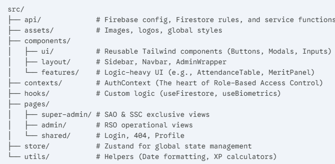

# ORSYS Web (Vantage) – Super Admin Control Center

**ORSYS (Organizational Reward System)**, also known as **Vantage**, is a gamified merit and attendance ecosystem designed for the Computer Studies Organization (CSO). This web-based dashboard serves as the central hub for administrators to manage student participation, biometric synchronization, and organizational growth.

## 🚀 Project Overview

Vantage bridges the gap between hardware and software by integrating ESP32 biometric sensors with a modern React frontend and Firebase backend. It is designed to increase student engagement through a competitive merit-based reward system.

### Key Features
* **Biometric Management:** Real-time ID mapping for AS608 fingerprint sensors.
* **Gamified Merit System:** Automated XP distribution and digital badge management.
* **Urgent Communication:** Integrated SMS gateway for critical student announcements.
* **Role-Based Access Control (RBAC):** Distinct interfaces for Super Admins (Chairman) and Admin (Committee Leaders).

## 📂 3. Directory Structure

The project follows a modular architecture to ensure scalability and ease of maintenance:

```text
src/
├── api/             # Firebase config, Firestore rules, and service functions
├── assets/          # Images, logos, global styles
├── components/       
│   ├── ui/          # Reusable Tailwind components (Buttons, Modals, Inputs)
│   ├── layout/      # Sidebar, Navbar, AdminWrapper
│   └── features/    # Logic-heavy UI (e.g., AttendanceTable, MeritPanel)
├── contexts/        # AuthContext (The heart of Role-Based Access Control)
├── hooks/           # Custom React Hooks (useFirestore, useBiometrics)
├── pages/            
│   ├── super-admin/ # SAO & SSC exclusive views
│   ├── admin/       # RSO operational views
│   └── shared/      # Login, 404, Profile
├── store/           # Zustand state management
└── utils/           # Helper functions (Date formatting, XP calculators)
```

### 🛠 3. Tech Stack
Tech Stack
Frontend: React.js (Vite + JavaScript)

Styling: Tailwind CSS v4

State Management: Zustand

Backend: Google Firebase (Firestore & Authentication)

Hardware: ESP32 + AS608 Biometric Sensor

## 👥 Proponents

The Vantage project is a collaborative effort by student leaders of the Computer Studies Organization (CSO) at **ACLC College of Mandaue**.

| 👤 Proponent | 🏷️ Title | 🎓 Institution |
| :--- | :--- | :--- |
| **Kent Jay Otadoy** | **Chairman**, CSO | ACLC College of Mandaue |
| **Manuel Cando** | **Gaming Committee Leader**, CSO | ACLC College of Mandaue |

> **Year & Course:** 3rd Year Bachelor of Science in Computer Science  
> **Project Scope:** Technopreneurship Feasibility Study and Software Engineering 2 2026

---

## ⚙️ Setup & Installation

### 1. Prerequisites
* Node.js (v18+)
* Firebase Project (Spark Plan)

### 2. Clone & Install
git clone https://github.com/Felaeia/ClubSys.git
cd ORSYS-Web
npm install

### 3. Environment Configuration
Create a `.env` file in the root directory:
```env
VITE_FIREBASE_API_KEY=your_api_key
VITE_FIREBASE_AUTH_DOMAIN=your_project.firebaseapp.com
VITE_FIREBASE_PROJECT_ID=your_project_id
VITE_FIREBASE_STORAGE_BUCKET=your_project.appspot.com
VITE_FIREBASE_MESSAGING_SENDER_ID=your_id
VITE_FIREBASE_APP_ID=your_app_id
```

4. Installation & Local Development

# Install dependencies
npm install

# Start the development server
npm run dev

Deployment

# Build for production
npm run build

# Deploy to Firebase Hosting
firebase deploy --only hosting