# 📘 ClubSys: An IoT-Integrated Organizational Management System

**An IoT-Integrated Organizational Management & Visualization System with Multi-Level Governance.**

---

## 🚀 Core Philosophy

ClubSys is a centralized web platform designed to digitize the chaotic management of school organizations by solving three specific critical problems:

1.  **The "Dictator" Problem:** Presidents often act unilaterally.
    *   **Solution: Software-Enforced Democracy.** Critical actions require a 2/3 majority vote from the organization's "Round Table" (Top 3 Heads).

2.  **The "Ghost Member" Problem:** Inaccurate membership records due to centralized vetting bottlenecks.
    *   **Solution: Distributed Vetting.** Committee Leads have the autonomy to vet and approve their own members, distributing the workload.

3.  **The "Manual Attendance" Problem:** Paper attendance sheets are slow, error-prone, and hard to digitize.
    *   **Solution: Cyber-Physical Verification.** A "Scan-to-Verify" IoT system using a mobile app and a physical hardware checkpoint.

## ✨ Key Differentiators

1.  **Software-Enforced Democracy:** Unlike most systems that grant one admin total control, the "Round Table" feature introduces a complex and impressive governance model.
2.  **Digital-Physical Bridge:** Connects the digital management process to a real-world attendance system via economical IoT hardware.
3.  **Resourcefulness:** Demonstrates that a smart, interactive environment can be built using existing smartphones and less than $10 worth of hardware.

---

## 🛠️ Key Features & Modules

*   **"Round Table" Governance Engine:** Enforces a democratic process for critical actions like structural changes and budget releases.
*   **Dynamic Org Tree Visualization:** A live, interactive, drag-and-drop chart (using Vue Flow) that reflects the real organizational hierarchy.
*   **Committee Vetting & Recruitment:** An autonomy model allowing Committee Leads to manage their own recruitment.
*   **Dual-Path Event Proposals:** Separate but integrated approval workflows for events proposed by Committee Leads vs. Org Heads.
*   **Autonomous Financial & Budget System:** Scoped financial control where committees manage their own allocated budgets.
*   **Strict Bulk Import:** An atomic validation system for admins to import user/org data, ensuring data integrity.
*   **Real-time Notification Hub:** Uses SignalR for instant UI updates, voting alerts, and IoT triggers.
*   **Secure Document Vault:** A centralized repository for documents with role-based permission levels.
*   **"End-of-Term" Turnover:** A streamlined process for archiving a school year's data and resetting officer roles.
*   **Announcement Board:** A centralized news feed for both school-wide and organization-specific announcements.
*   **IoT "Smart Checkpoint" Integration:** A hardware-based system for event attendance verification.

---

## 💻 Tech Stack

*   **Frontend:** Vue.js (Vite)
*   **State Management:** Pinia
*   **HTTP Client:** Axios
*   **Visualization:** Vue Flow & Vue-Advanced-Cropper
*   **Backend:** .NET Core Web API (C#)
*   **Real-Time:** SignalR
*   **Database:** Microsoft SQL Server with Entity Framework Core
*   **Authentication:** JWT (JSON Web Tokens)
*   **Hardware:** ESP8266/ESP32 (programmed in Arduino C++)

---

## 🏗️ System Architecture

### High-Level Data Flow

This diagram illustrates the flow of data between the frontend, backend, database, and IoT hardware for key operations.

```mermaid
graph TD
    subgraph "External Systems"
        U(👨 User);
        IOT[⚡️ IoT Device];
    end

    subgraph "Frontend (Vue.js App)"
        direction LR
        LP[Login Page];
        DB[Dashboard];
        OTB[Org Tree Builder];
        GOV[Governance Dashboard];
        ATT[Mobile Attendance Scanner];
        FIN[Budget Request Page];
    end

    subgraph "Backend (.NET API)"
        direction LR
        AUTH[Auth Controller];
        TREE[Org TreeController];
        PROP[Proposals Controller];
        VOTE[Votes Controller];
        ATT_API[Attendance Controller];
        FIN_API[Finance Controller];
        SR_HUB[📡 SignalR Hub];
    end

    subgraph "Data Stores (MS SQL)"
        direction LR
        UsersTbl[(Users)];
        TreeNodesTbl[(TreeNodes)];
        ProposalsTbl[(Proposals)];
        VotesTbl[(Votes)];
        AttendanceTbl[(AttendanceLogs)];
        BudgetTbl[(BudgetRequests)];
    end

    U -- Credentials --> LP;
    LP -- POST /login --> AUTH;
    AUTH -- Reads Hash --> UsersTbl;
    AUTH -- Returns JWT --> LP;

    U -- Navigates to --> OTB;
    OTB -- GET /tree --> TREE;
    TREE -- Reads Data --> TreeNodesTbl;
    TREE -- Sends Tree JSON --> OTB;
    
    OTB -- POST /proposals --> PROP;
    PROP -- Creates Proposal --> ProposalsTbl;
    PROP -- Pushes Notification --> SR_HUB;
    SR_HUB -- Notifies Other Heads --> GOV;
    
    U -- Scans QR Code --> ATT;
    ATT -- POST /attendance/scan --> ATT_API;
    ATT_API -- Logs Scan --> AttendanceTbl;
    ATT_API -- Sends 'Green/Red' Signal --> SR_HUB;
    SR_HUB -- Pushes Command --> IOT;
```

### Database Schema (ERD)

The database is organized into five logical modules: Identity & Membership, Organization Structure, Governance & History, Operations & Communications, and Finance.

---

## 📚 Full Documentation

For more detailed information, please refer to the documents in the `.Documentation` directory:
- `PlanV6Final.md`: The complete project specification.
- `ErdV3Final.md`: The detailed database schema and table definitions.
- `DataFlowDiagram.md`: The complete data flow diagram with explanations.
- `flowchart.md`: Detailed logical flowcharts for all major system processes.

